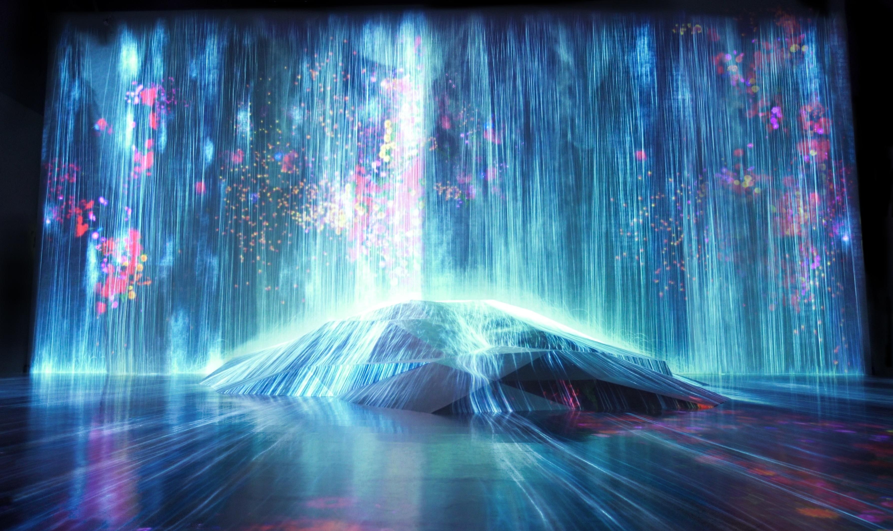
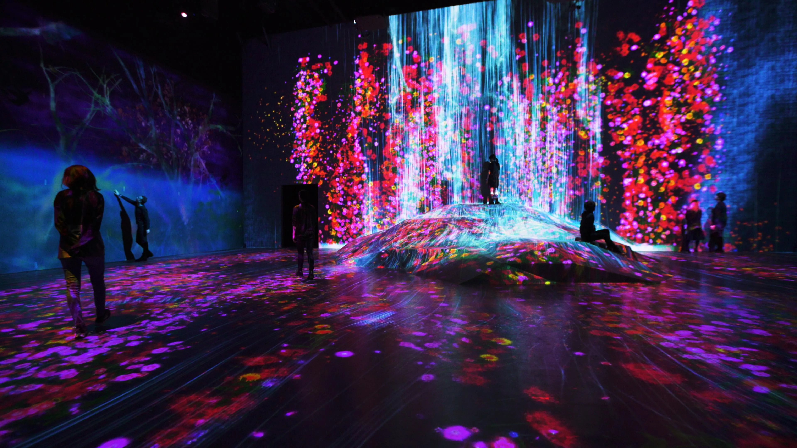
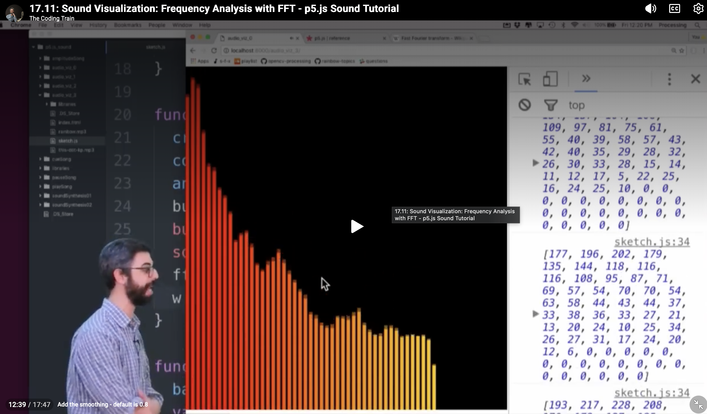

# Quiz 8

## Part 1: Imaging Technique Inspiration

### Imaging Technique
**Audio-reactive immersive fluid visualization**

### Discussion
My inspiration comes from teamLab’s *Universe of Water Particles on a Rock where People Gather*. This work uses real-time particle simulation so visitors can alter water flow by touching or entering the space. I want to apply this logic of fluid lines, real-time transformation, and embodied immersion in my project. This direction is beneficial because it turns interaction into expressive visual narrative and can integrate well with my team’s other mechanics.

### Screenshots / Images

### Example Sources
- [teamLab: Universe of Water Particles on a Rock where People Gather](https://art.team-lab.cn/en/ew/iwa-waterparticles/)

---

## Part 2: Coding Technique Exploration

### Coding Technique
**`p5.FFT` frequency analysis**

### Discussion
I will use `p5.FFT` to analyse audio by frequency bands and map that data to visual behavior. Low frequencies can drive large wave movement, while higher frequencies can control fine line flicker and particle detail. FFT values will also map to particle flow strength and line density, so audio energy reshapes waterfall-like motion inspired by teamLab. Because FFT returns structured spectrum data every frame, the visuals can react to sound in real time while remaining controllable and readable.

### Screenshot / Image

### Example Implementation Link
- [The Coding Train - Frequency Analysis with FFT](https://thecodingtrain.com/tracks/sound/sound/11-sound-visualization-frequency-analysis)

### Example Code Link
- [Coding Train source code](https://github.com/CodingTrain/website/tree/main/CodingChallenges)
